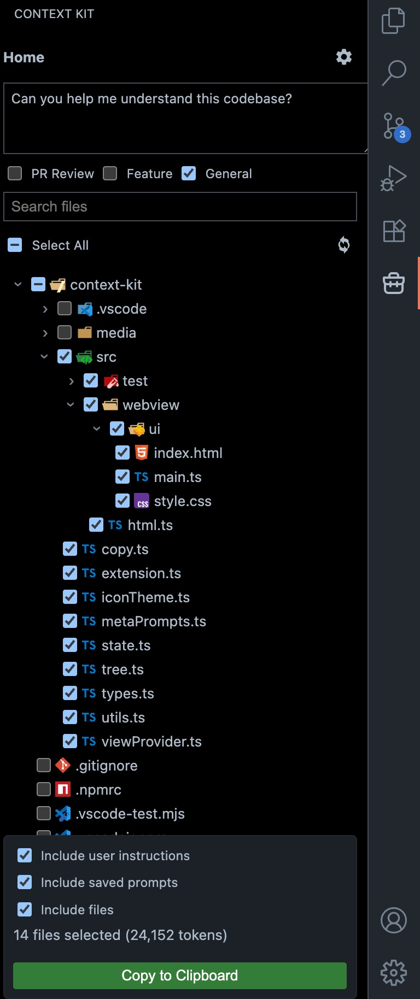
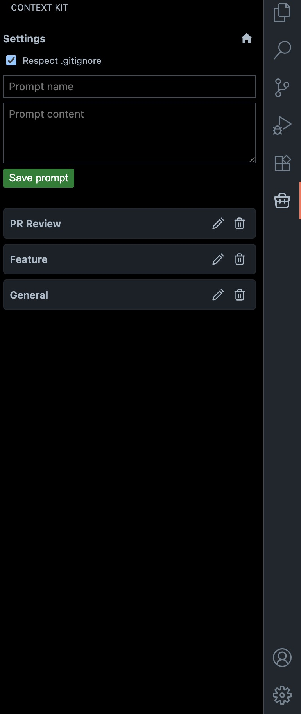

# Context Kit

Manage context for AI assistants right in VS Code. An extension that lives in your editor, helping you efficiently select and copy file context with an intuitive tree view.

## Screenshots

<p align="center">
  
  
</p>

## Features

- **Visual File Selection**: Browse your workspace with a tree view and select files to include in your context
- **Smart Gitignore Support**: Automatically respects `.gitignore` rules (toggleable)
- **Context Formatting**: Copies selected files in an XML-formatted structure optimized for AI assistants
- **Meta Prompts**: Create and manage reusable prompt templates
- **File Tree Overview**: Includes a visual file tree structure in the copied context
- **User Instructions**: Add custom instructions alongside your file context
- **Selection Summary**: View file count and estimated token count for your selection
- **Binary & Size Filtering**: Automatically skips binary files and files over 2MB

## Usage

1. Open the Context Kit panel from the activity bar (left sidebar)
2. Select files from your workspace tree
3. (Optional) Add user instructions in the text area
4. (Optional) Select meta prompts to include
5. Click "Copy Context" or use the command palette

The extension will copy formatted context to your clipboard, ready to paste into your AI assistant.

## Context Format

The copied context follows this XML structure:

```xml
<context>

<fileTree>
src/
  file1.ts
  file2.ts
</fileTree>

<file path="src/file1.ts">
// file contents
</file>

<metaInstructions>
<metaInstruction name="Code Review">
Review this code for best practices
</metaInstruction>
</metaInstructions>

<userInstructions>
Your custom instructions here
</userInstructions>

</context>
```

## Commands

- `Context Kit: Open Context Kit` - Opens the Context Kit panel
- `Context Kit: Copy Context Selection` - Copies the current selection to clipboard

## Configuration Options

- **Respect Gitignore**: Toggle whether to respect `.gitignore` rules (toggle in the panel)
- **Include User Instructions**: Include/exclude your custom instructions
- **Include Saved Prompts**: Include/exclude selected meta prompts
- **Include Files**: Include/exclude file contents (useful for copying just instructions)

## Development

### Code Quality
This project uses [Biome](https://biomejs.dev/) for code formatting and ESLint for linting.

```bash
pnpm run format    # Format all code with Biome
pnpm run lint      # Lint code with ESLint
```

### Building
```bash
pnpm run compile   # Build extension and webview
pnpm run watch     # Watch mode for development
```

## Known Limitations

- Files larger than 2MB are automatically skipped
- Binary files are not included in the context
- Symbolic links are followed but may cause issues with circular references

## License

MIT
